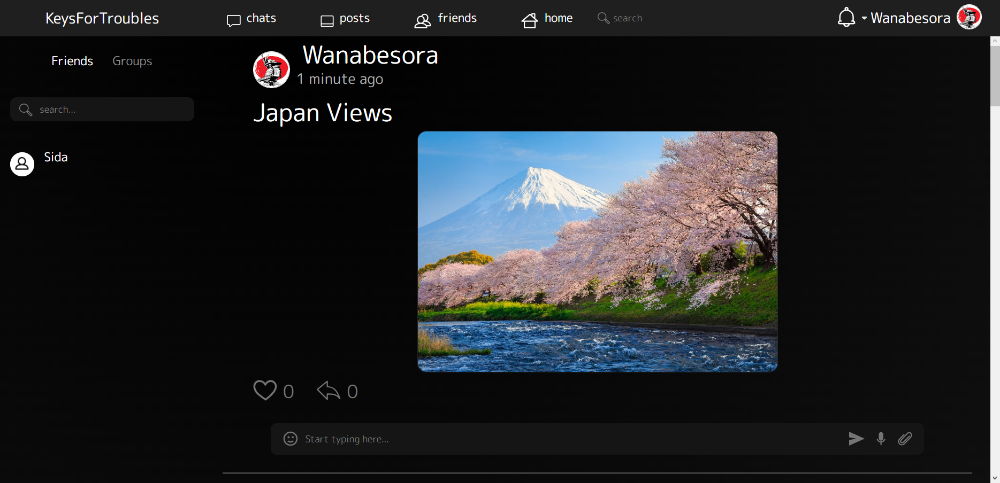

# KeysForTroubles - Social Network (PERN Stack)

A full-featured social network application built with PostgreSQL, Express.js, React, and Node.js. This project demonstrates a complete full-stack architecture with user authentication, real-time features, and a responsive front-end.

### ✨ [Live Demo](https://keysfortroubles.onrender.com) ✨



---

## Features

* **User Authentication:** Secure user registration and login using JWT (JSON Web Tokens).
* **Post Creation & Feed:** Authenticated users can create, edit, and delete their own posts.
* **Real-Time Chat:** Integrated real-time messaging using Socket.IO.
* **Responsive Design:** The application is fully responsive and works on mobile and desktop browsers.
* **RESTful API:** A well-structured backend API built with Express.js and Sequelize ORM.

---

## Tech Stack

* **Frontend:** React, React Router, MobX, Socket.IO Client, Bootstrap
* **Backend:** Node.js, Express.js, PostgreSQL, Sequelize, JWT, Socket.IO
* **Hosting:** Render

---

## Getting Started

To run this project locally, follow these steps:

1.  Clone the repository:
    ```bash
    git clone [https://github.com/Tryharder782/KFT](https://github.com/Tryharder782/KFT)
    ```
2.  Install backend dependencies:
    ```bash
    cd KFT
    npm install
    ```
3.  Install frontend dependencies:
     ```bash
    cd client
    npm install
    ```
4.  Create + Set up your environment variables in a `.env` file in the root directory (you will need a PostgreSQL database URI, JWT secret, etc.):
5.  ```bash
    PORT = 5000
    DB_NAME = KeysForTroubles
    DB_USER = postgres
    DB_PASSWORD = password
    DB_HOST = localhost
    DB_PORT = 5432
    SECRET_KEY = secret
    SENDGRID_API_KEY='yourSGAPIKey'
    ```
    (change the respective values to your liking)
6.  Run the development server:
    ```bash
    npm run dev
    ```
